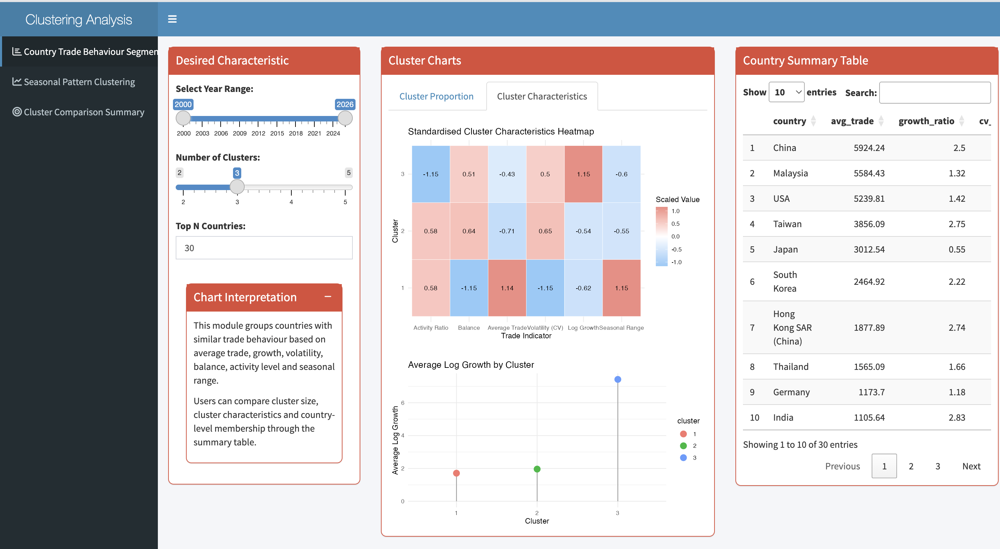
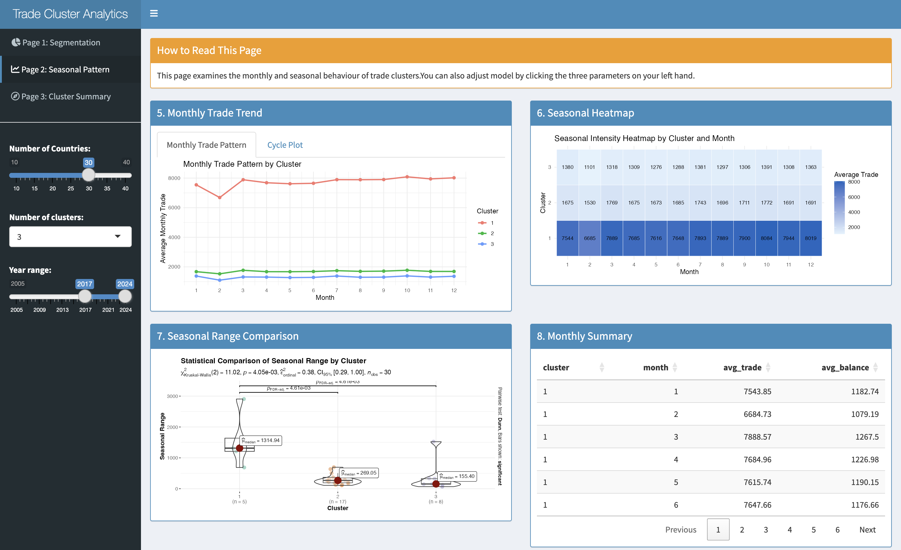
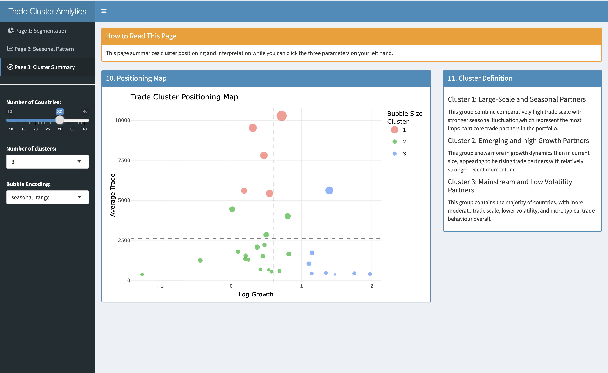

# 2.1 The Task

In this take-home exercise, we are required to select one of the module of your proposed Shiny application (Group Project) and complete the following tasks:

-   To evaluate and determine the necessary R packages needed for your Shiny application are supported in R CRAN,

-   To prepare and test the specific R codes can be run and returned the correct visual output as expected,

-   To determine the parameters and outputs that will be exposed on the Shiny applications, and,

-   To select the appropriate Shiny UI components for exposing the parameters above determine.

# 2.2 Getting Started

Before the analysis, I first loaded the packages required for this task and imported the two sets of raw data: Import and Export.

```{r}
# load required packages
pacman::p_load(readxl, tidyverse, cluster, lubridate,ggstatsplot)
# import dataset
import_raw <- read_excel("data/Import.xlsx")
export_raw <- read_excel("data/Export.xlsx")
```

# 2.3 Data Preparation and Cleaning

Since the data is currently stored in two individual Excel files, Import and Export, it is necessary to clean the two sets of data separately and then organize them into a single long table structure that can be merged before the formal analysis.

```{r}
import_df <- import_raw[-1, ]
names(import_df)[1] <- "date"
# Excel serial date -> Date
import_df$date <- as.Date(as.numeric(import_df$date), origin = "1899-12-30")
import_df <- import_df %>%
  mutate(across(-date, as.numeric))
```

```{r}
#clean export data, change data into date, turn data type into numeric
export_df <- export_raw[-1, ]
names(export_df)[1] <- "date"
export_df$date <- as.Date(as.numeric(export_df$date), origin = "1899-12-30")
export_df <- export_df %>%
  mutate(across(-date, as.numeric))
```

```{r}
#reshaping data into long format
import_long <- import_df %>%
  pivot_longer(
    cols = -date,
    names_to = "country",
    values_to = "import_value"
  )

export_long <- export_df %>%
  pivot_longer(
    cols = -date,
    names_to = "country",
    values_to = "export_value"
  )
```

```{r}
#combine import and export
trade_long <- full_join(import_long, export_long, by = c("date", "country")) %>%
  mutate(
    import_value = replace_na(import_value, 0),
    export_value = replace_na(export_value, 0),
    total_trade = import_value + export_value,
    trade_balance = export_value - import_value,
    trade_ratio = if_else(import_value > 0, export_value / import_value, NA_real_),
    year = year(date),
    month = month(date)
  )
trade_long <- trade_long %>%
  filter(year >= 2005)
```

```{r}
glimpse(trade_long)
summary(trade_long$year)
range(trade_long$year, na.rm = TRUE)
```

# 2.4 Selecting top 30 Countries by total trade value

Analyzing all countries directly with providing broader coverage would also introduce a large number of countries with consistently low trade volumes and limited information, making clustering results more difficult to interpret.

Furthermore, too many inactive countries in the sample can lead to the reduction in the cluster's discriminative power. Therefore, in this prototype, I chose to first filter out the Top 30 countries based on total trade volume.

```{r}
#we need to exclude the regions which are not countries
exclude_regions <- c("Asia", "Europe", "America", "EU", "Oceania", "Africa")

trade_long_clean <- trade_long %>%
  filter(!country %in% exclude_regions)
#then we select top 30 countries
top30_countries <- trade_long_clean %>%
  group_by(country) %>%
  summarise(
    total_trade_sum = sum(total_trade, na.rm = TRUE),
    .groups = "drop"
  ) %>%
  arrange(desc(total_trade_sum)) %>%
  slice_head(n = 30) %>%
  pull(country)

trade_top30 <- trade_long_clean %>%
  filter(country %in% top30_countries)
```

```{r}
unique(trade_top30$country)
length(unique(trade_top30$country))
```

# 2.5 Building Features for Clustering

To perform clustering, I couldn't simply dump monthly detailed data. Instead, I needed to first summarize each country into a set of characteristics that could represent its overall trade relations.

In this section, I constructed the following features:

-   avg_trade: Average trade size

-   recent_trade: Average trade in recent years

-   early_trade: Average trade in earlier periods

-   sd_trade: Volatility

-   avg_import: Average imports

-   avg_export: Average exports

-   avg_balance: Average trade balance

Based on these, I further derived two variables that better fit the design:

growth_ratio: Growth rate in recent years relative to earlier periods

cv_trade: Relative volatility (coefficient of variation)

The reason for this approach is that I hope the final clustering results will more closely resemble the following categories of country relations:

-   Countries with consistently high long-term trade volumes

-   Emerging countries with high volatile and seasonal relationships in recent years

-   Countries with persistently low and stable activity levels

```{r}
min_year <- min(trade_top30$year, na.rm = TRUE)
max_year <- max(trade_top30$year, na.rm = TRUE)
```

```{r}
#base feature
country_base <- trade_top30 %>%
  group_by(country) %>%
  summarise(
    avg_trade = mean(total_trade, na.rm = TRUE),
    sd_trade = sd(total_trade, na.rm = TRUE),
    active_month_ratio = mean(total_trade > 0, na.rm = TRUE),
    avg_import = mean(import_value, na.rm = TRUE),
    avg_export = mean(export_value, na.rm = TRUE),
    avg_balance = mean(trade_balance, na.rm = TRUE),
    .groups = "drop"
  )
```

```{r}
#recent & early trade
recent_trade_tbl <- trade_top30 %>%
  filter(year >= max_year - 2) %>%
  group_by(country) %>%
  summarise(
    recent_trade = mean(total_trade, na.rm = TRUE),
    .groups = "drop"
  )

early_trade_tbl <- trade_top30 %>%
  filter(year <= min_year + 2) %>%
  group_by(country) %>%
  summarise(
    early_trade = mean(total_trade, na.rm = TRUE),
    .groups = "drop"
  )
```

```{r}
#seasonal feature
seasonal_features <- trade_top30 %>%
  group_by(country, month) %>%
  summarise(
    monthly_avg_trade = mean(total_trade, na.rm = TRUE),
    .groups = "drop"
  ) %>%
  group_by(country) %>%
  summarise(
    seasonal_range = max(monthly_avg_trade, na.rm = TRUE) - min(monthly_avg_trade, na.rm = TRUE),
    .groups = "drop"
  )
```

```{r}
#combine all features
country_features <- country_base %>%
  left_join(recent_trade_tbl, by = "country") %>%
  left_join(early_trade_tbl, by = "country") %>%
  left_join(seasonal_features, by = "country") %>%
  mutate(
    growth_ratio = log((recent_trade + 1) / (early_trade + 1)),
    cv_trade = if_else(avg_trade > 0, sd_trade / avg_trade, NA_real_)
  )
#check
colSums(is.na(country_features))
```

2.5 define final variables

Before clustering, I only retain the following variables:

-   `avg_trade`

-   `growth_ratio`

-   `cv_trade`

-   `seasonal_range`

-   `avg_balance`

Also, I remove records with missing values.

```{r}
country_features2 <- country_features %>%
  select(
    country,
    avg_trade,
    growth_ratio,
    cv_trade,
    seasonal_range,
    avg_balance
  ) %>%
  drop_na()
```

```{r}
nrow(country_features2)
summary(country_features2)
```

# 2.6 Standardization by using k-means

This step involves standardization before clustering. Ideally, in this prototype, I'll use 3 clusters:

-   Large-Scale Partners
-   Mainstream Partners
-   Emerging Partners

Of course, the specific clusters will depend on the results from shinyapp and will require further adjustments.

```{r}
country_features2_clean <- country_features2 %>%
  filter(
    !is.na(avg_trade),
    !is.na(growth_ratio),
    !is.na(cv_trade),
    !is.na(seasonal_range),
    !is.na(avg_balance),
    is.finite(avg_trade),
    is.finite(growth_ratio),
    is.finite(cv_trade),
    is.finite(seasonal_range),
    is.finite(avg_balance)
  )

cluster_data <- country_features2_clean %>%
  select(
    avg_trade,
    growth_ratio,
    cv_trade,
    seasonal_range,
    avg_balance
  )

cluster_data_scaled <- scale(cluster_data)

set.seed(123)
km3 <- kmeans(cluster_data_scaled, centers = 3, nstart = 25)

country_features2_clean$cluster <- as.factor(km3$cluster)
```

```{r}
apply(cluster_data, 2, sd, na.rm = TRUE)
```

# 2.7 Trade Relationship Segmentation

This section is to identify different types of trading partners.

## 2.7.1 Cluster distribution

The following is a bar chart showing how many countries are included in each cluster.

```{r}
plot_table1 <- country_features2_clean %>%
  count(cluster) %>%
  mutate(
    share = round(100 * n / sum(n), 1),
    label = paste0("n = ", n, "\n", share, "%")
  )

ggplot(plot_table1, aes(x = factor(cluster), y = n, fill = factor(cluster))) +
  geom_col() +
  geom_text(aes(label = label), vjust = -0.2, size = 4) +
  scale_y_continuous(limits = c(0, max(plot_table1$n) * 1.15)) +
  labs(
    title = "Number and Share of Countries in Each Cluster",
    x = "Cluster",
    y = "Count",
    fill = "Cluster"
  ) +
  theme_minimal()
```

## 2.7.2 Performance of the features of each cluster

Next, I used heatmap to compare the overall performance of each cluster across several key features.

In this section, I focused on comparing:

Average Trade

Growth Ratio

Volatility (CV) Trade

Seasonal Range

Average Balance

```{r}
plot_table2_scaled <- country_features2_clean %>%
  group_by(cluster) %>%
  summarise(
    avg_trade = mean(avg_trade, na.rm = TRUE),
    growth_ratio = mean(growth_ratio, na.rm = TRUE),
    cv_trade = mean(cv_trade, na.rm = TRUE),
    seasonal_range = mean(seasonal_range, na.rm = TRUE),
    avg_balance = mean(avg_balance, na.rm = TRUE),
    .groups = "drop"
  )

plot_table2_scaled_num <- plot_table2_scaled %>%
  select(-cluster) %>%
  scale() %>%
  as.data.frame()

plot_table2_scaled_num$cluster <- plot_table2_scaled$cluster

plot_table2_scaled_long <- plot_table2_scaled_num %>%
  pivot_longer(
    cols = -cluster,
    names_to = "variable",
    values_to = "value"
  )

ggplot(plot_table2_scaled_long, aes(x = variable, y = cluster, fill = value)) +
  geom_tile(color = "white") +
  geom_text(aes(label = round(value, 2)), size = 3.5) +
  scale_fill_gradient2(
    low = "#90CAF9",
    mid = "white",
    high = "#F28B82",
    midpoint = 0
  ) +
  scale_x_discrete(
    labels = c(
      "avg_trade" = "Average Trade",
      "growth_ratio" = "Log Growth",
      "cv_trade" = "Volatility (CV)",
      "active_month_ratio" = "Activity Ratio",
      "seasonal_range" = "Seasonal Range",
      "avg_balance" = "Balance"
    )
  ) +
  labs(
    title = "Standardised Cluster Characteristics Heatmap",
    x = "Trade Indicator",
    y = "Cluster",
    fill = "Scaled Value"
  ) +
  theme_minimal()
```

## 2.7.3 Statistical comparison of cluster indicators

```{r}
ggbetweenstats( 
  data = country_features2_clean, 
  x = cluster, 
  y = avg_trade, 
  type = "np", 
  pairwise.comparisons = TRUE, 
  pairwise.display = "s", 
  p.adjust.method = "fdr", 
  messages = FALSE, 
  xlab = "Cluster", 
  ylab = "Average Trade", 
  title = "Statistical Comparison of Average Trade by Cluster", 
  centrality.label.args = list(size = 3) 
  )
```

You can select which indicator you want to do statistical test on Shinyapp.This page shows only one.

## 2.7.4 Summary table with cluster labels

```{r}
summary_table <- country_features2_clean %>%
  group_by(cluster) %>%
  summarise(
    `Number of Countries` = n(),
    `Share (%)` = paste0(round(100 * n() / nrow(country_features2_clean), 1), "%"),
    `Average Trade` = round(mean(avg_trade, na.rm = TRUE), 2),
    `Growth Ratio` = round(mean(growth_ratio, na.rm = TRUE), 2),
    `Volatility (CV)` = round(mean(cv_trade, na.rm = TRUE), 2),
    `Seasonal Range` = round(mean(seasonal_range, na.rm = TRUE), 2),
    .groups = "drop"
  ) %>%
  mutate(
    `Cluster Label` = case_when(
      as.character(cluster) == "1" ~ "Large-scale and seasonal partners",
      as.character(cluster) == "2" ~ "Emerging and high growth partners",
      as.character(cluster) == "3" ~ "Mainstream lower-volatility partners",
      TRUE ~ "Additional cluster"
    )
  ) %>%
  arrange(cluster)
```

In Shinyapp, each cluster will only have one, see in UI design.

# 2.8 UI Design - Part 1

This page displays the clustering results, helping users understand how selected countries are categorized based on trade characteristics.

Motivation: The main purpose of this page is to show users the overall cluster structure, including the size and key characteristics of each cluster, and whether there are significant differences between different clusters. This serves as the basis for subsequent monthly and seasonal analyses.

Below is a visual of the prototype for this page. 

[**Functionality and Interactivity**]{.underline}

Users can adjust the Number of countries, Number of clusters and rank countries by the metrics they choose themselves, all are parameters in the left-hand control panel. And also for the KW and Dunn's test, there's one comparison metric for users to choose to update the test.

This page includes the following sections:

-   Cluster Distribution: Shows how many countries each cluster contains and their percentage.

-   Cluster Characteristics Heatmap: Shows the correlation of each cluster across different metrics, such as seasonality of growth.

-   Statistical Comparison: Shows the statistical differences between clusters across all metrics.

-   Cluster Summary: Summarizes the main characteristics and corresponding labels for each cluster.

**Other Considerations**

I designed this page basically to answer the overall question:"How are these countries be clustered?" And I added a brief explanation at the top of the page and arranged the charts in the order of Overall Distribution—Characteristic Overview—Statistical Comparison—Summary for be easily and logically understood.

# 2.9 Seasonal Pattern Clustering

In section 2.9, we further compare whether these clusters still exhibit different behavioral patterns at the monthly level.

Therefore, I first merged the cluster labels obtained from Page 1 back into the original monthly data, so that each country-month record carries the corresponding cluster information. This allows us to subsequently observe trade behavior along the cluster × month dimension.

```{r}
#join cluster
trade_clustered <- trade_top30 %>%
  left_join(
    country_features2_clean %>% select(country, cluster),
    by = "country"
  )
monthly_cluster_summary <- trade_clustered <- trade_top30 %>%
  left_join(
    country_features2_clean %>% select(country, cluster),
    by = "country"
  )
#check
glimpse(trade_clustered)
table(is.na(trade_clustered$cluster))
```

```{r}
monthly_cluster_summary <- trade_clustered %>%
  group_by(cluster, month) %>%
  summarise(
    avg_trade = mean(total_trade, na.rm = TRUE),
    avg_import = mean(import_value, na.rm = TRUE),
    avg_export = mean(export_value, na.rm = TRUE),
    avg_balance = mean(trade_balance, na.rm = TRUE),
    .groups = "drop"
  )
```

## 2.9.1 Monthly Trade Pattern by Cluster

```{r}
ggplot(monthly_cluster_summary,
       aes(x = month, y = avg_trade, color = cluster, group = cluster)) +
  geom_line(linewidth = 1) +
  geom_point(size = 2) +
  scale_x_continuous(breaks = 1:12) +
  labs(
    title = "Monthly Trade Pattern by Cluster",
    x = "Month",
    y = "Average Monthly Trade",
    color = "Cluster"
  ) +
  theme_minimal()
```

## 2.9.2 Cycle Plot of Monthly Trade By cluster

This cycle plot is to show the Monthly trade in years which reflects the time-series patterns.

```{r}
cluster_year_month <- trade_clustered %>%
  filter(year >= 2017) %>%
  group_by(cluster, year, month) %>%
  summarise(
    avg_trade = mean(total_trade, na.rm = TRUE),
    .groups = "drop"
  )

cluster_year_month$month <- factor(
  cluster_year_month$month,
  levels = 1:12,
  labels = month.abb,
  ordered = TRUE
)

hline_data <- cluster_year_month %>%
  group_by(cluster, month) %>%
  summarise(
    avgvalue = mean(avg_trade, na.rm = TRUE),
    .groups = "drop"
  )

ggplot() +
  geom_line(
    data = cluster_year_month,
    aes(x = year, y = avg_trade, group = month),
    colour = "black"
  ) +
  geom_hline(
    data = hline_data,
    aes(yintercept = avgvalue),
    linetype = 2,
    colour = "red",
    linewidth = 0.4
  ) +
  facet_grid(cluster ~ month) +
  scale_x_continuous(breaks = seq(2017, 2026, by = 3)) +
  labs(
    title = "Cycle Plot of Monthly Trade by Cluster",
    x = "",
    y = "Average Monthly Trade"
  ) +
  theme_minimal() +
  theme(
    axis.text.x = element_text(size = 6, angle = 45, hjust = 1),
    strip.text = element_text(size = 10)
  )
```

## 2.9.3 Seasonal Intensity Heatmap by Cluster and Month

```{r}
ggplot(monthly_cluster_summary, aes(x = factor(month), y = cluster, fill = avg_trade)) +
  geom_tile(color = "white") +
  geom_text(aes(label = round(avg_trade, 0)), size = 3) +
  scale_fill_gradient(
    low = "#E3F2FD",
    high = "#1565C0"
  ) +
  labs(
    title = "Seasonal Intensity Heatmap by Cluster and Month",
    x = "Month",
    y = "Cluster",
    fill = "Average Trade"
  ) +
  theme_minimal()
```

## 2.9.4 Statistical Comparison of **Seasonal Range** by Cluster

```{r}
ggbetweenstats(
  data = country_features2_clean,
  x = cluster,
  y = seasonal_range,
  type = "np",
  pairwise.comparisons = TRUE,
  pairwise.display = "s",
  p.adjust.method = "fdr",
  messages = FALSE,
  xlab = "Cluster",
  ylab = "Seasonal Range",
  title = "Statistical Comparison of Seasonal Range by Cluster",
  centrality.label.args = list(size = 3)
)
```

You can select which indicator you want to do the statistical analysis in shinyAPP.This page only shows one as the example. \## 2.9.5 Monthly Summary Table by Cluster

```{r}
monthly_summary_table <- monthly_cluster_summary %>%
  transmute(
    cluster = cluster,
    month = month,
    avg_trade = round(avg_trade, 2),
    avg_balance = round(avg_balance, 2)
  ) %>%
  arrange(cluster, month)

knitr::kable(
  monthly_summary_table,
  caption = "Monthly Summary Table by Cluster"
)
```

# 2.10 UI Design – Part 2

This page displays the monthly and seasonal variation characteristics of a cluster.

Motivation: The main purpose of this page is to help users further understand whether different clusters exhibit different performance over time, especially in terms of monthly variations and seasonal patterns.

Below is a visual of the prototype for this page. 

[**Functionality and Interactivity**]{.underline}

Users only need to uniformly number of clusters, and Numbers of countries, year range and whether users want to rank countries by any metrics on the left, and charts on the page will update simultaneously. There's also the seasonal metrics on the left for users to change for confirmatory comparison of the KW and Dunn's test.

This page includes the following sections:

-   Monthly Trade Trend: Shows the monthly trade trends of different clusters.

-   Seasonal Heatmap: Shows the distribution of trade intensity of a cluster across different months.

-   Seasonal Range Comparison: Compares whether there are significant differences in seasonal fluctuations among different clusters.

-   Monthly Summary: Displays the monthly average results for the cluster in a table.

**Other Considerations**

I chose to place all the charts on this page on the same page and share the same set of control parameters because users typically want to observe all seasonal charts simultaneously under the same filtering conditions. I believe this improves page consistency and reduces the hassle of switching parameters back and forth.

# 2.11 Cluster Comparison Summary

In this section, I use a positioning map to summarize what these three types of partners mean.The goal is to integrate the results from the first two pages into a more concise and user-friendly summary view.

## 2.11.1 Trade Cluster Positioning Map

Therefore, I used a bubble chart with quadrant lines to construct a Trade Cluster Positioning Map.

In this chart:

-   The x-axis represents Log Growth

-   The y-axis represents Average Trade

-   The bubble size represents the Seasonal Range

-   The color represents the cluster to which a country belongs

Additionally, I added two reference dashed lines to represent the average levels of Log Growth and Average Trade for all countries, thus dividing the chart into four regions.

```{r}
#use seasonal range as bubble size
positioning_map <- ggplot(
  country_features2_clean,
  aes(
    x = growth_ratio,
    y = avg_trade,
    size = seasonal_range,
    color = factor(cluster)
  )
) +
  geom_point(alpha = 0.75) +
  geom_vline(
    xintercept = mean(country_features2_clean$growth_ratio, na.rm = TRUE),
    linetype = "dashed",
    color = "grey50"
  ) +
  geom_hline(
    yintercept = mean(country_features2_clean$avg_trade, na.rm = TRUE),
    linetype = "dashed",
    color = "grey50"
  ) +
  labs(
    title = "Trade Cluster Positioning Map",
    x = "Log Growth",
    y = "Average Trade",
    size = "Seasonal Range",
    color = "Cluster"
  ) +
  theme_minimal()

positioning_map
```

## 2.11.2 Cluster Definition(Panel)

**Cluster 1: Large-Scale Partners**

These countries are characterized by high average trade volume for most months of the year, stable growth rates, and relatively large seasonal fluctuations. Therefore, they can be considered a group of large, stable trading partners in the long term.

**Cluster 2: Emerging Partners**

Although this group of countries does not have the largest overall trade volume, they stand out the most in terms of growth indicators, particularly indicating a more pronounced upward trend in recent years. Therefore, we consider this group of countries to be more characteristic of emerging trading partners.

**Cluster 3: Mainstream Partners**

This group comprises the vast majority of the sample, with most indicators at a moderate level. Specifically, they are neither extremely high-growth nor extremely large-scale, thus representing the most typical and common mainstream trading partners.

# 2.12 UI Design – Part 3

This page presents a summary and explanation of cluster locations.

Motivation: The main purpose of this page is to summarize the analysis results from the previous two pages and, through a bubble map and four quadrants, allow users to more intuitively understand the position of each cluster in terms of trade volume, growth, and volatility, as well as what type of country relations each cluster represents.

Below is a visual of the prototype for this page. [**Functionality and interactivity**]{.underline}

Users can continue to use the “Numbers of Countries" and "Number of Clusters" parameters on the left, and can also adjust the bubble encoding to see the display effect when different variables are used as bubble sizes, users can also choose which cluster they want to highlight.

This page includes two parts:

Positioning Map: Shows the location distribution of different clusters and countries based on growth and trade volume.

Cluster Definition: Summarizes the meaning and main characteristics of each cluster in text.

**Additional Consideration**

This page is designed to be concise because I only want to give it the function of summarizing the results rather than showing too much detailed analysis. I placed the map and text explanation on the same page to make users' better understanding of the cluster definition and meaning while viewing the map.

# 2.13 References

Kam, T.S. (2025).R for visual Analytics. [https://r4va.netlify.app]{.underline}
